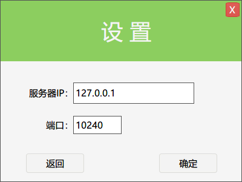
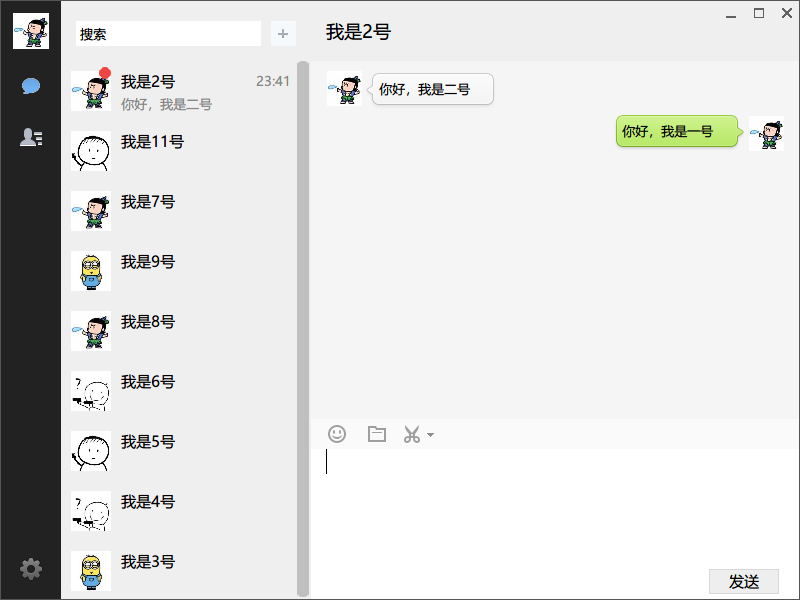
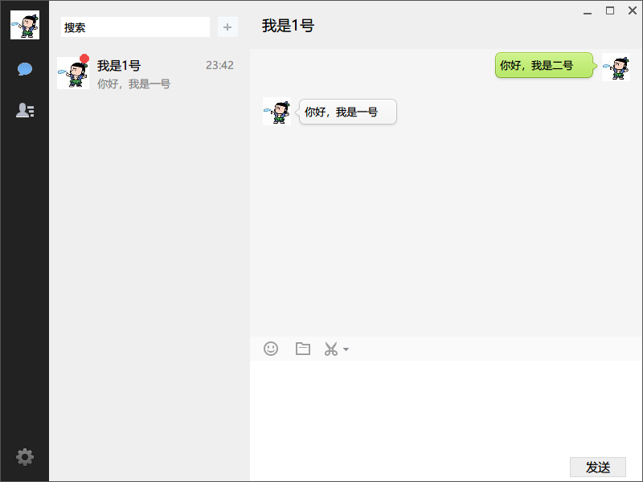
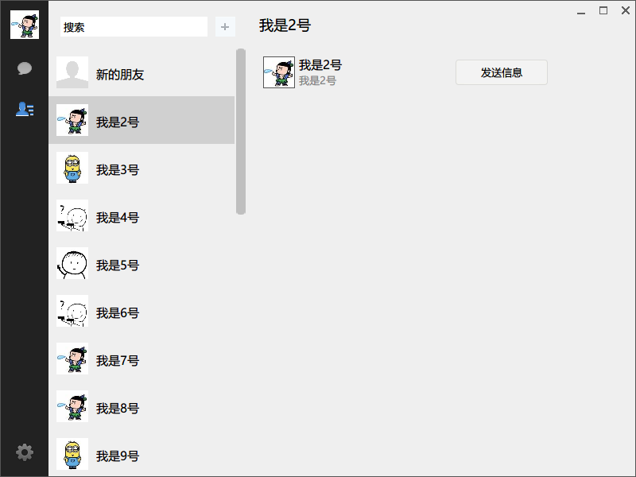
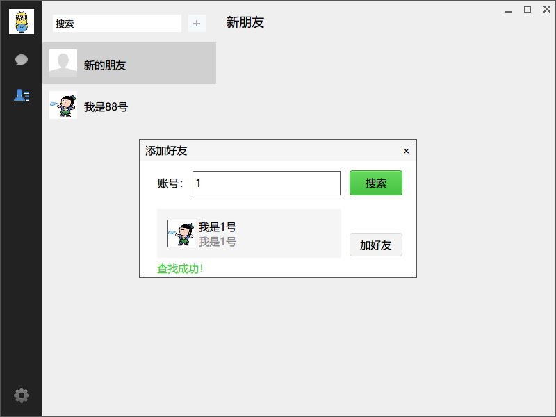
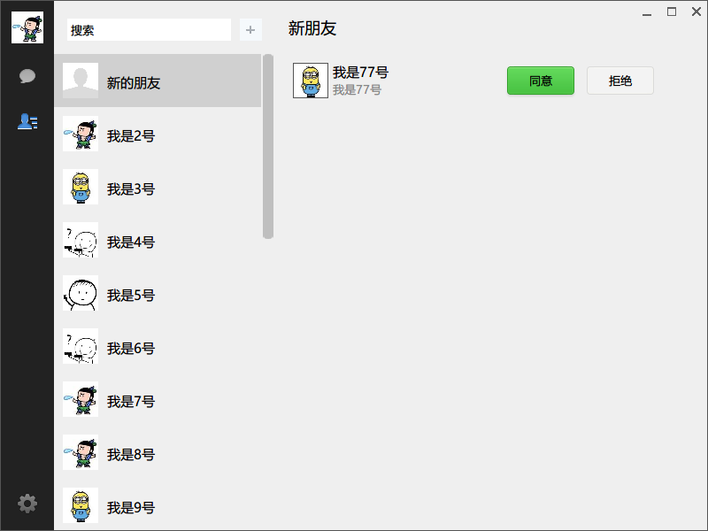
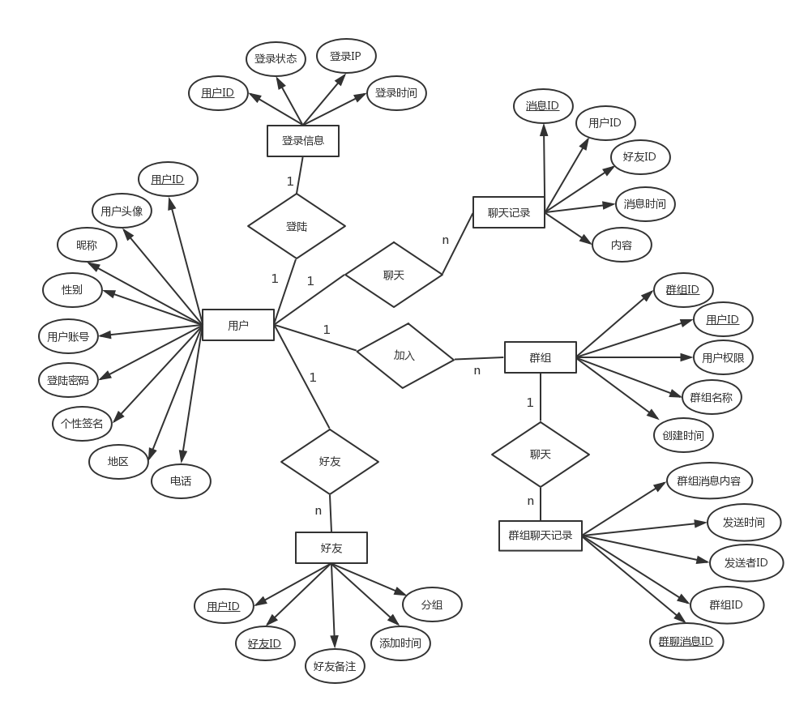

# duilib_ChatClient
 
*A chat app client than the ui base on duilib and with network communications! This project is not completed!
 

一个用duilib写的聊天客户端应用，尚未完成，后续会配套一个服务器端的应用，都是基于Windows平台。
 

   客户端代码：https://github.com/TTGuoying/duilib_ChatClient

　 服务器代码：https://github.com/TTGuoying/duilib_ChatServer

　 本软件是本人个人学习duilib UI库过程中创作，所用素材皆取值网络，代码开源用于学习交流只用，如有侵权，请邮件guoying_tan@qq.com告知，立即删除。

　 本软件使用到 [duilib UI库](https://github.com/duilib/duilib) ，[sqlite](http://www.sqlite.org/index.html)，[RapidJSON GitHub](https://github.com/Tencent/rapidjson/)，windows win32编程，网络编程。

　　开发工具：VS2017

　　本人能力有限，从2018年2月9日开始，陆陆续续写了将近一个月（3月5日 00:05），中间还有春节忙前忙后，所用时间不多，软件还有BUG，已经可以正常使用。
 
软件截图

.png)

